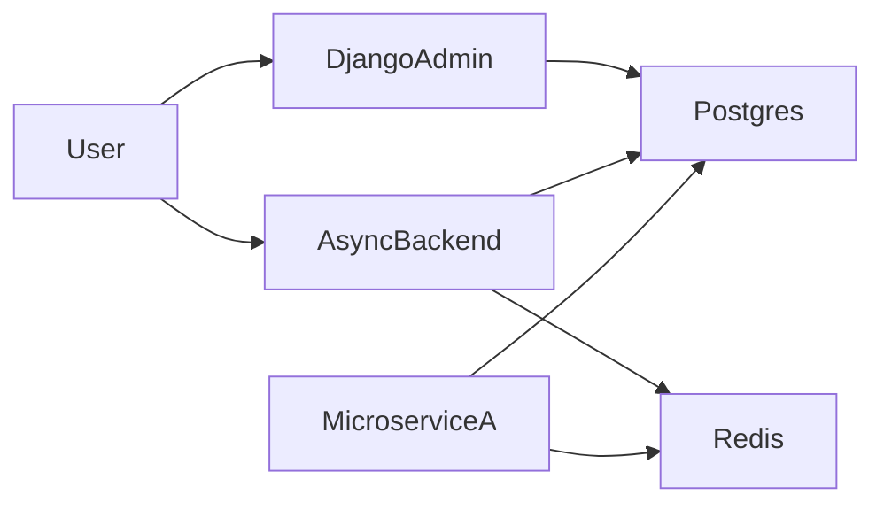

# Архитектура и запуск

## Компоненты
- `admin/` — Django админка для управления данными.
- `backend/` — асинхронный backend (asyncio + tortoise-orm).
- `services/` — каркасы будущих микросервисов.
- `infra/` — инфраструктурные скрипты и шаблоны.
- `shared/` — общие библиотеки и контракты.

## Запуск через docker-compose
```bash
docker-compose up --build
```

## Окружение
Все сервисы читают параметры БД и Redis из переменных окружения, которые
заданы в `docker-compose.yml`.

## Диаграмма взаимодействия


## Добавление микросервиса
1. Скопируйте шаблон из `services/example_service`.
2. Настройте Dockerfile, зависимости и конфигурацию.
3. Добавьте сервис в `docker-compose.yml`.
